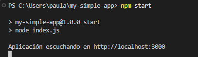
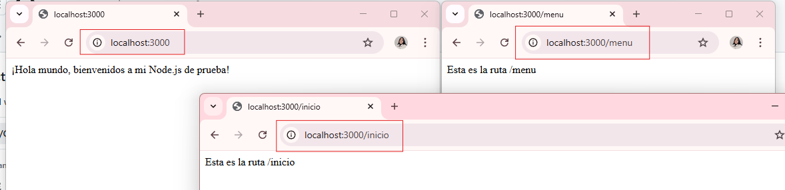
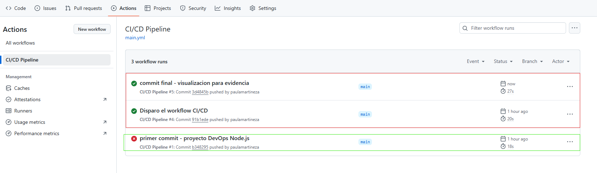
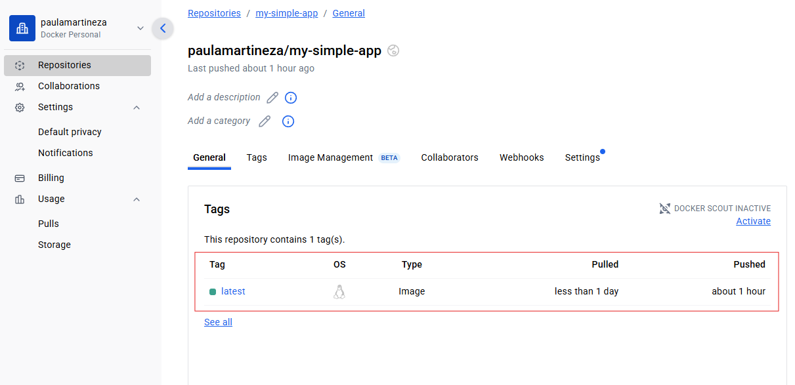
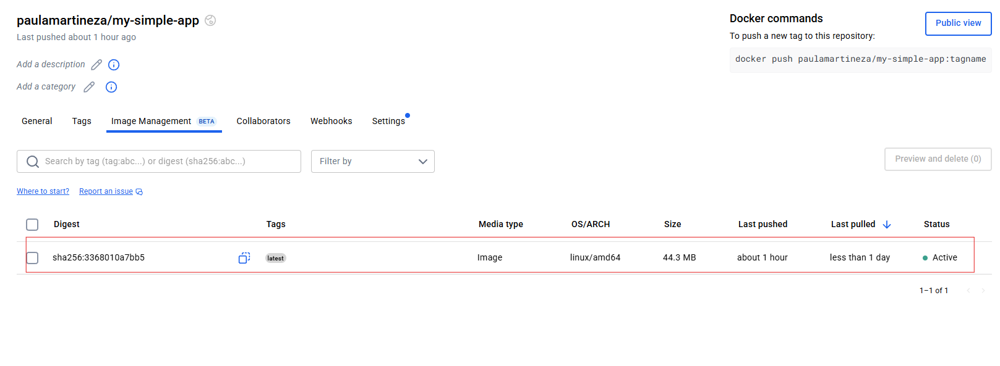
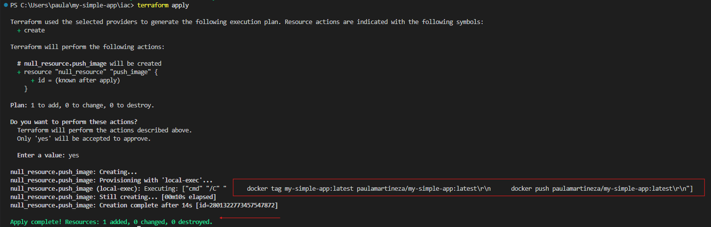

# 🚀 Aplicación Node.js - Reto DevOps

Este proyecto forma parte de un reto DevOps, y su objetivo es contenerizar una aplicación Node.js sencilla, configurar un pipeline CI/CD con GitHub Actions y simular un despliegue automatizado usando Terraform como Infraestructura como Código (IaC). Se aplicaron buenas prácticas de contenerización y automatización en el flujo de desarrollo.

---

## 📦 Requisitos

- Node.js + Express
- Docker
- GitHub Actions
- Terraform (null_resource / local-exec)
- Markdown
---

## ⚙️ Instalación local

1. Instala las dependencias:

```bash

npm install 

--- 

### 👉 Comandos para probar localmente

1. Construir la imagen:

```bash
docker build -t my-simple-app .

2. Ejecutar el cntenedor:

```bash
docker run -p 3000:3000 my-simple-app

3. Comando para ejecutar contenedor opcional:

```bash
npm start


## 🤖 GitHub Actions

```markdown

## 🤖 GitHub Actions

Se automatizó el flujo CI/CD con GitHub Actions en la ruta `.github/workflows/main.yml`.

### ¿Qué hace el pipeline?

- Instala dependencias de Node.js
- (Opcional) Ejecuta análisis de código o linter
- Hace login en Docker Hub usando secretos
- Construye la imagen Docker
- Hace `push` de la imagen a Docker Hub

El workflow se activa automáticamente con cada `push` a la rama `main`.

### Comandos para subir los cambios al repo:

```bash
git add .
git commit -m "Actualizar proyecto"
git push origin main


## ⚙️ Terraform

Se simuló el despliegue de la imagen Docker usando **Terraform** como herramienta de Infraestructura como Código (IaC).

### Archivos utilizados:

- `main.tf` → ejecuta comandos locales (`docker tag` y `docker push`)
- `variables.tf` → define las variables reutilizables
- `terraform.tfvars` → contiene los valores como nombre de la imagen y usuario Docker

### Para ejecutarlo:

```bash
cd iac
terraform init
terraform apply

---------------------------------------------------------------
Última actualización: 12 de junio de 2025.
---------------------------------------------------------------

## 📸 Evidencias

### ✅ Contenedor corriendo localmente




### ✅ GitHub Actions funcionando


### ✅ Imagen publicada en Docker Hub



### ✅ Terraform ejecutando push


----------------------------------------------------

## ✅ Estado del reto: ¡Completado!

✔️ Aplicación corriendo en contenedor  
✔️ Imagen publicada en Docker Hub  
✔️ CI/CD automatizado con GitHub Actions  
✔️ Despliegue simulado con Terraform como IaC  
✔️ Evidencias documentadas


## 👩‍💻 Autora
**Paula Andrea**  
Estudiante de Ingeniería de Sistemas  
Amante del diseño, lo creativo y el mundo DevOps ✨
